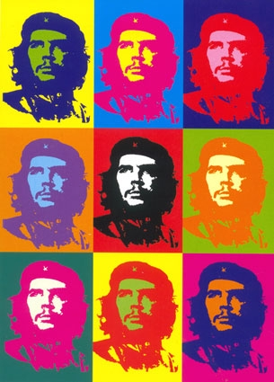

```{r setup, include=FALSE}
options(htmltools.dir.version = FALSE)
```
class: center, middle
background-image: url("https://i1.wp.com/www.solidcolore.com/3840/e4c6a7_background.jpg")

> Because you don't have to live in a `theme_bw()` world

---
class: center, middle
background-image: url("https://i1.wp.com/www.solidcolore.com/3840/e4c6a7_background.jpg")

## Most examples show a simple side-by-side layout


but so much more is possible with `CSS`
---
class: middle, center
background-image: url("https://i1.wp.com/www.solidcolore.com/3840/e4c6a7_background.jpg")
### Create an image grid with `ninjutsu` theme


---
class: middle, center
background-image: url("https://i1.wp.com/www.solidcolore.com/3840/e4c6a7_background.jpg")

Andy Warhols infamous `Che Guevara` painting is actually a forgery created by Gerard Malanga (who was in need of money) and sold to a gallery in Rome. 



I thought it would be fun to create my own foRgery in `xaringan`

---
background-image: url("https://www.wallpaperup.com/uploads/wallpapers/2014/01/29/241813/bce28d4f416a4554a1147162a81372b2-1000.jpg")
class: center, split-four

.column[


]

.column[


]

.column[


]